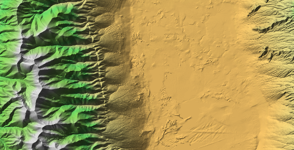

These scripts show how to create shaded relief images from a DEM file.



* The script **hillshade** shows how does the hillshade algorithm work. It shows the image using **matplotlib**
* The script **shaded_relief.py** creates the shaded relief image. To test it, you can use the file **w001001.tiff**, and the usage is:

```
Usage:
    shaded_relief.py [-band=1] [-azimuth=315] [-altitude=45] data_file color_file output_file
```

The file w001001.tiff was downloaded from the [Seamless Data Warehouse page from the USGS](http://seamless.usgs.gov/website/seamless/viewer.htm), as explained [in this post](http://geoexamples.blogspot.com/2012/02/raster-classification-with-gdal-python.html).

The sample color file **colorfile.clr** gives convenient values for the w001001.tiff DEM file.

You can get more information in this [GeoExamples blog entry](http://geoexamples.blogspot.com/2014/03/shaded-relief-images-using-gdal-python.html)